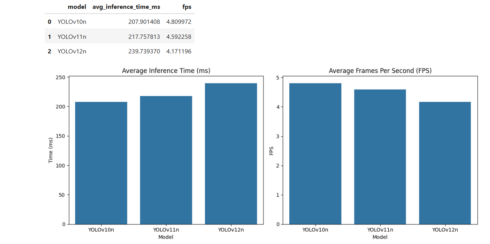

# YOLO Object Detection and Tracking: Model Comparison

A comprehensive comparison of inference speeds between YOLOv10n, YOLOv11n, and YOLOv12n models on object tracking tasks.

## 📋 Overview

This project benchmarks the performance of three YOLO nano models (YOLOv10n, YOLOv11n, and YOLOv12n) by comparing their inference speeds and tracking capabilities on video data. The comparison provides insights into the trade-offs between model versions and helps in selecting the most suitable model for real-time applications.

## ✨ Features

- **Multi-model comparison**: Supports YOLOv10n, YOLOv11n, and YOLOv12n
- **Performance metrics**: Measures inference time, FPS, and tracking accuracy
- **Visual analysis**: Generates comparison charts and annotated output videos
- **GPU/CPU support**: Automatically detects and utilizes available hardware
- **Comprehensive reporting**: Detailed analysis with performance statistics

## 🚀 Quick Start

### Prerequisites

- Python 3.8 or higher
- CUDA-compatible GPU (optional, for faster inference)

### Installation

1. Clone this repository:
```bash
git clone https://github.com/yourusername/Yolo-Model-Comparison.git
cd Yolo-Model-Comparison
```

2. Install required dependencies:
```bash
pip install -r requirements.txt
```

3. Place your test video file in the project directory and name it `test1.mp4`, or update the `video_path` variable in the notebook.

### Usage

1. Open the Jupyter notebook:
```bash
jupyter notebook yolo_object_tracking_comparison.ipynb
```

2. Run all cells in sequence to:
   - Install dependencies
   - Load YOLO models
   - Process video with each model
   - Generate performance comparisons
   - Create visualizations

## 📊 Results

The notebook generates several outputs:

- **Performance metrics table**: Comparison of inference times and FPS
- **Visualization charts**: Bar plots showing speed differences
- **Annotated videos**: Object tracking results for each model
- **Sample frames**: Visual comparison of detection quality

### Performance Comparison Results


*Performance benchmark results showing inference time and FPS comparison between YOLOv10n, YOLOv11n, and YOLOv12n models.*

*YOLOv10n demonstrates the best performance with ~4.81 FPS and 207ms average inference time.*




### Example Output Structure
```
output_videos/
├── YOLOv10n_tracked.mp4
├── YOLOv11n_tracked.mp4
├── YOLOv12n_tracked.mp4
├── inference_speed_comparison.png
└── model_comparison_frames.png
```

## 🔧 Configuration

### Model Parameters
- **Confidence Threshold**: 0.5
- **IoU Threshold**: 0.45
- **Input Resolution**: 640x640

### Customization
You can modify the following parameters in the notebook:
- `CONFIDENCE_THRESHOLD`: Adjust detection sensitivity
- `IOU_THRESHOLD`: Control overlap threshold for detections
- `video_path`: Change input video file
- `output_dir`: Modify output directory

## 📈 Performance Analysis

The project provides detailed performance analysis including:

- Average inference time per frame (ms)
- Frames per second (FPS) for each model
- Speed difference percentages between models
- Visual comparison of tracking quality

## 🛠️ Technical Details

### Dependencies
- **ultralytics**: YOLO model implementation
- **opencv-python**: Video processing
- **pandas**: Data manipulation
- **matplotlib/seaborn**: Visualization
- **torch**: Deep learning framework

### Hardware Requirements
- **Minimum**: 8GB RAM, CPU-only inference
- **Recommended**: 16GB RAM, NVIDIA GPU with 6GB+ VRAM

## 📝 File Structure

```
├── yolo_object_tracking_comparison.ipynb  # Main notebook
├── test1.mp4                             # Input video (user-provided)
├── YOLOv10n_tracked.mp4                  # Output video from YOLOv10n
├── YOLOv11n_tracked.mp4                  # Output video from YOLOv11n
├── YOLOv12n_tracked.mp4                  # Output video from YOLOv12n
├── requirements.txt                      # Dependencies
├── README.md                            # Documentation
├── LICENSE                              # License file
└── .gitignore                          # Git ignore rules
```

## 🤝 Contributing

1. Fork the repository
2. Create a feature branch (`git checkout -b feature/new-feature`)
3. Commit your changes (`git commit -am 'Add new feature'`)
4. Push to the branch (`git push origin feature/new-feature`)
5. Create a Pull Request

## 📄 License

This project is licensed under the MIT License - see the [LICENSE](LICENSE) file for details.

## 🙏 Acknowledgments

- [Ultralytics](https://github.com/ultralytics/ultralytics) for the YOLO implementations
- YOLO research community for continuous model improvements

## 📧 Contact

**Ahmed Mossad** - [ahmed.abdelfattah.mossad@gmail.com](mailto:ahmed.abdelfattah.mossad@gmail.com)

Project Link: [https://github.com/ahmedm0ssad/YOLO-Model-Comparison](https://github.com/ahmedm0ssad/YOLO-Model-Comparison)

---

**Note**: Replace `test1.mp4` with your own video file for testing. The models will be automatically downloaded on first use.
